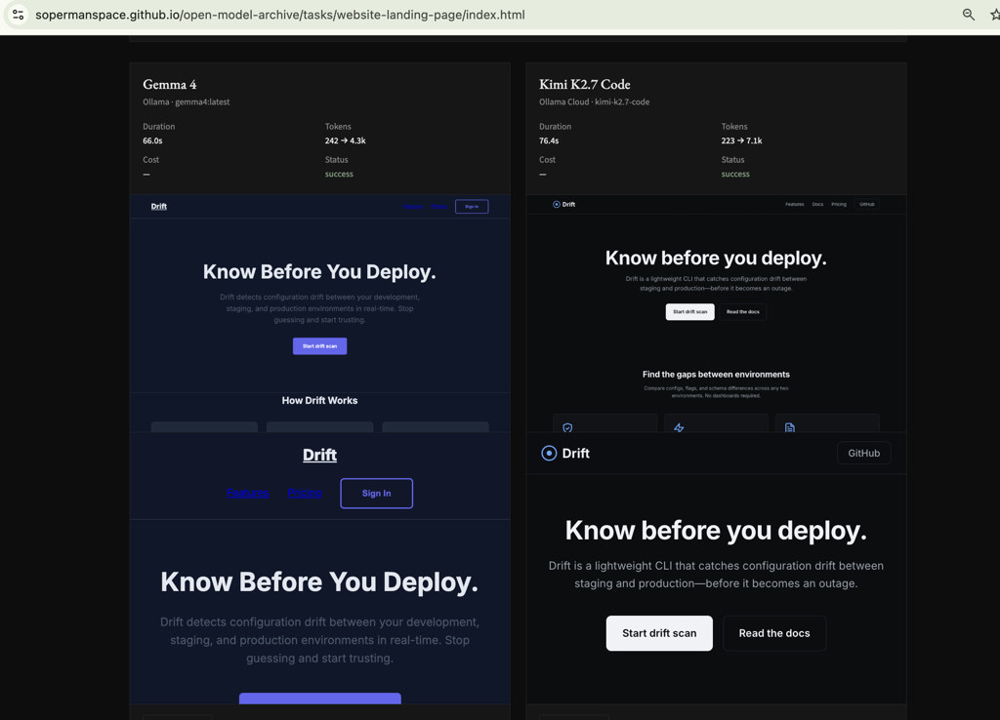

# Open Model Archive

[](LICENSE)
[](https://sopermanspace.github.io/open-model-archive/)
[](pyproject.toml)

## The world's most transparent repository of AI model outputs on identical real-world tasks

**Not another benchmark.** No hidden prompts. No aggregated scores. A public archive where developers inspect exactly what each model generated — source files, screenshots, timing, tokens, and estimated cost — for the same versioned prompt.

**[Explore the live archive →](https://sopermanspace.github.io/open-model-archive/)**

Includes **blog writing**, humor, creative fiction, elementary & college math, and 6 other task categories.

---

## What you can compare today

| Category | Task | Topics |
|----------|------|--------|
| Website generation | Developer Tool Landing Page | design, code |
| Code generation | Token Bucket Rate Limiter | code |
| SVG generation | Weather Icon Set | design, code |
| Web grounding | Grounded Product Q&A | reasoning |
| Vision understanding | Landing Page Visual Analysis | vision, design |
| Design critique | Expert Designer Critique | vision, design |
| Blog writing | Configuration Drift Blog | writing, reasoning |
| Humor testing | Kubernetes Golden Retriever | humor, writing |
| Creative fiction | Startup Launch Fiction | creative, writing |
| Math | Elementary Word Problems | math, reasoning |
| Math | College Calculus & Linear Algebra | math, reasoning |

All tasks run against **Gemma 4**, **Kimi K2.7 Code**, and **Gemini 3.1 Pro** unless noted.

Every task uses **prompt v1.0.0** — immutable, SHA-256 hashed, committed to Git.

---

## Side-by-side preview

<p align="center">
  <a href="https://sopermanspace.github.io/open-model-archive/tasks/website-landing-page/">
    
  </a>
</p>

<p align="center"><em>Same prompt. Three models. <a href="https://sopermanspace.github.io/open-model-archive/tasks/website-landing-page/">Open the full comparison</a> — snapshot and live preview are separated, not stacked.</em></p>

---

## Why this exists

Leaderboards answer: *"Which model scores higher?"*

Developers need: *"What did it actually write?"*

Open Model Archive stores the full output in Git. The website is a read-only lens over committed artifacts.

---

## Model providers

| Type | Integration | Examples |
|------|-------------|----------|
| Open-source / Ollama cloud | Ollama HTTP API | Gemma 4, Kimi K2.7 Code |
| Frontier models | Provider CLI | Gemini 3.1 Pro |
| OpenAI | API adapter | GPT-5.5, GPT-5.4, GPT-5.5 Instant (templates) |
| Anthropic | API adapter | Claude Sonnet 5, Fable 5, Mythos 5 (templates) |
| OpenRouter | API adapter | Llama 3.3 70B (template) |
| Together / Fireworks / Sarvam | API adapter | Community templates |

**Contributors welcome** — add models from any provider. See [CONTRIBUTING.md](CONTRIBUTING.md).

Costs are estimated from per-1k token rates in `models/*.yaml`. Run `oma recost` to recalculate without re-executing.

---

## Quick start

```bash
git clone https://github.com/sopermanspace/open-model-archive.git
cd open-model-archive

uv sync
npm install && npx playwright install chromium

ollama pull gemma4:latest
ollama pull kimi-k2.7-code:cloud

uv run oma build
python -m http.server 8080 --directory docs
```

| Command | Description |
|---------|-------------|
| `oma validate` | Check tasks, prompts, models |
| `oma run --all` | Execute all tasks |
| `oma recost` | Recalculate cost from tokens |
| `oma generate` | Build static site |
| `oma build` | Full pipeline |

---

## Repository layout

```
prompts/     Versioned prompts (immutable)
tasks/       Task definitions
models/      Provider + pricing config
runs/        Public execution archive
docs/        Generated GitHub Pages site
src/oma/     Build pipeline
```

---

## Documentation

- [Architecture](ARCHITECTURE.md)
- [Setup](SETUP.md)
- [Deployment](DEPLOYMENT.md)
- [Contributing](CONTRIBUTING.md)

---

## License

[MIT](LICENSE)