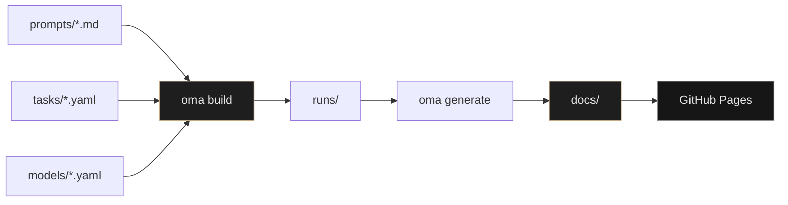

<div align="center">

# Open Model Archive

**The most transparent public record of what AI models actually produce.**

[](https://sopermanspace.github.io/open-model-archive/)
[](LICENSE)
[](pyproject.toml)
[](https://sopermanspace.github.io/open-model-archive/)

[Explore the archive](https://sopermanspace.github.io/open-model-archive/) · [Contributing](CONTRIBUTING.md) · [Architecture](ARCHITECTURE.md)

</div>

---

> **Not another benchmark.** No hidden prompts. No aggregated scores.  
> Every run is versioned, committed, and inspectable — source files, screenshots, timing, tokens, and estimated cost, side by side for the same prompt.

<br>

<p align="center">
  <a href="https://sopermanspace.github.io/open-model-archive/tasks/website-landing-page/">
    
  </a>
</p>

<p align="center">
  <sub>Same prompt · three models · <a href="https://sopermanspace.github.io/open-model-archive/tasks/website-landing-page/">open the full comparison</a> with snapshot and live preview tabs</sub>
</p>

<br>

## Why this exists

| Leaderboards answer | Developers need |
| :--- | :--- |
| *"Which model scores higher?"* | *"What did it actually write, build, and draw?"* |

Most evaluations reduce models to a number. **Open Model Archive** preserves the full artifact — HTML, code, SVG, markdown, raw text — in Git. The website is a read-only lens over committed runs, not a black-box scoreboard.

<br>

## What you get per run

<table>
<tr>
<td width="50%" valign="top">

**Transparency**
- Versioned prompts with SHA-256 hashes
- Raw model output always available
- Public `runs/` directory — Git is the archive

</td>
<td width="50%" valign="top">

**Comparison**
- Side-by-side columns per model
- Snapshot + live preview for HTML tasks
- Rendered markdown for blog posts
- Fullscreen mode for long outputs

</td>
</tr>
<tr>
<td width="50%" valign="top">

**Metrics**
- Duration, input/output tokens
- Estimated cost from `models/*.yaml` rates
- Provider-reported or tiktoken-estimated counts

</td>
<td width="50%" valign="top">

**Reproducibility**
- One command rebuilds the entire site
- `oma recost` updates pricing without re-running
- Add tasks, models, and prompts via YAML

</td>
</tr>
</table>

<br>

## Models in the archive

<p align="center">
  
  &nbsp;&nbsp;&nbsp;
  
  &nbsp;&nbsp;&nbsp;
  <strong>Gemini 3.1 Pro</strong>
</p>

<p align="center">
  <sub>All 11 tasks run against <strong>Gemma 4</strong>, <strong>Kimi K2.7 Code</strong>, and <strong>Gemini 3.1 Pro</strong> unless a task specifies otherwise.</sub>
</p>

| Provider | Integration | Status |
| :--- | :--- | :---: |
| Ollama | Local + cloud API | **Active** |
| Provider CLI | Frontier models (Gemini) | **Active** |
| OpenAI | API adapter | Template |
| Anthropic | API adapter | Template |
| OpenRouter · Together · Fireworks · Sarvam | API adapters | Template |

Contributors can enable any adapter — see [CONTRIBUTING.md](CONTRIBUTING.md).

<br>

## Task library

11 real-world tasks across 9 categories. Every task uses **prompt v1.0.0** — immutable and committed to Git.

| Category | Task | Topics | Compare |
| :--- | :--- | :--- | :--- |
| Website generation | Developer Tool Landing Page | design, code | [View →](https://sopermanspace.github.io/open-model-archive/tasks/website-landing-page/) |
| Code generation | Token Bucket Rate Limiter | code | [View →](https://sopermanspace.github.io/open-model-archive/tasks/rate-limiter/) |
| SVG generation | Weather Icon Set | design, code | [View →](https://sopermanspace.github.io/open-model-archive/tasks/weather-icons/) |
| Web grounding | Grounded Product Q&A | reasoning | [View →](https://sopermanspace.github.io/open-model-archive/tasks/product-facts-grounding/) |
| Vision understanding | Landing Page Visual Analysis | vision, design | [View →](https://sopermanspace.github.io/open-model-archive/tasks/landing-visual-analysis/) |
| Design critique | Expert Designer Critique | vision, design | [View →](https://sopermanspace.github.io/open-model-archive/tasks/landing-design-critique/) |
| Blog writing | Configuration Drift Blog | writing, reasoning | [View →](https://sopermanspace.github.io/open-model-archive/tasks/config-drift-blog/) |
| Humor testing | Kubernetes Golden Retriever | humor, writing | [View →](https://sopermanspace.github.io/open-model-archive/tasks/kubernetes-golden-retriever/) |
| Creative fiction | Startup Launch Fiction | creative, writing | [View →](https://sopermanspace.github.io/open-model-archive/tasks/startup-launch-fiction/) |
| Math | Elementary Word Problems | math, reasoning | [View →](https://sopermanspace.github.io/open-model-archive/tasks/elementary-math/) |
| Math | College Calculus & Linear Algebra | math, reasoning | [View →](https://sopermanspace.github.io/open-model-archive/tasks/college-math/) |

<br>

## How it works



```
prompts/     Versioned prompts (immutable Markdown + frontmatter)
tasks/     Task definitions (category, models, screenshot flags)
models/    Provider config, pricing, adapter type
runs/      Public execution archive (run.json + artifacts)
docs/      Generated static site for GitHub Pages
src/oma/   CLI, adapters, engine, site generator
```

<br>

## Quick start

**Prerequisites:** Python 3.12+, [uv](https://docs.astral.sh/uv/), [Ollama](https://ollama.com/), Node.js 20+ (screenshots only)

```bash
git clone https://github.com/sopermanspace/open-model-archive.git
cd open-model-archive

uv sync
npm install && npx playwright install chromium

ollama pull gemma4:latest
ollama pull kimi-k2.7-code:cloud

uv run oma build
python -m http.server 8080 --directory docs
```

Open `http://localhost:8080/open-model-archive/` to preview locally.

### CLI commands

| Command | What it does |
| :--- | :--- |
| `oma validate` | Check tasks, prompts, and model configs |
| `oma run --all` | Execute all tasks against all enabled models |
| `oma run --task <slug> --all` | Run one task across all models |
| `oma recost` | Recalculate cost from stored token counts |
| `oma generate` | Build static site into `docs/` |
| `oma build` | Validate → run → generate (full pipeline) |
| `oma build --skip-run` | Regenerate site from existing `runs/` |

Full setup details: [SETUP.md](SETUP.md) · Deployment: [DEPLOYMENT.md](DEPLOYMENT.md)

<br>

## Contributing

Add a task, wire up a model, or improve the pipeline. The archive grows through pull requests — every new run is a public artifact.

1. Fork the repo
2. Add or edit YAML in `tasks/`, `prompts/`, or `models/`
3. Run `oma build` and commit `runs/` + `docs/`
4. Open a PR

See [CONTRIBUTING.md](CONTRIBUTING.md) for the full guide.

<br>

<div align="center">

**[→ Open the live archive](https://sopermanspace.github.io/open-model-archive/)**

<br>

<sub>MIT License · Every prompt versioned · Every artifact public</sub>

</div>