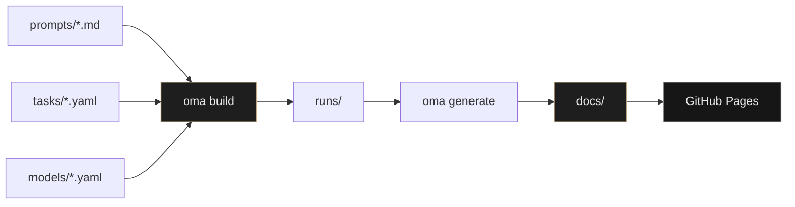

<div align="center">

# Open Model Archive

**The most transparent public record of what AI models actually produce.**

[](https://sopermanspace.github.io/open-model-archive/)
[](LICENSE)
[](pyproject.toml)
[](https://sopermanspace.github.io/open-model-archive/)

[Explore the archive](https://sopermanspace.github.io/open-model-archive/) · [Contributing](CONTRIBUTING.md) · [Architecture](ARCHITECTURE.md)

</div>

---

> **Not another benchmark.** No hidden prompts. No aggregated scores.  
> Every run is versioned, committed, and inspectable — source files, screenshots, timing, tokens, and estimated cost, side by side for the same prompt.

<br>

<p align="center">
  <a href="https://sopermanspace.github.io/open-model-archive/tasks/website-landing-page/">
    
  </a>
</p>

<p align="center">
  <sub>Same prompt · multiple models · <a href="https://sopermanspace.github.io/open-model-archive/tasks/website-landing-page/">open the full comparison</a> with snapshot and live preview tabs</sub>
</p>

<br>

## Why this exists

| Leaderboards answer | Developers need |
| :--- | :--- |
| *"Which model scores higher?"* | *"What did it actually write, build, and draw?"* |

Most evaluations reduce models to a number. **Open Model Archive** preserves the full artifact — HTML, code, SVG, markdown, raw text — in Git. The website is a read-only lens over committed runs, not a black-box scoreboard.

<br>

## Any model. Any provider.

The archive is **model-agnostic**. You are not required to run Gemma, Kimi, Gemini, or anything else. Pick whatever you have access to — wire it up in `models/*.yaml`, run the tasks, commit the artifacts, open a PR.

**Have a key? Have Ollama? Have a CLI? You can contribute.**

| Adapter | Works with | Authentication | Ships with |
| :--- | :--- | :--- | :--- |
| `ollama` | **Any** Ollama model — local or cloud | Ollama running on your machine | Gemma 4, Kimi K2.7 Code |
| `cli` | **Any** model behind an installed provider CLI | Your local CLI session | Gemini 3.1 Pro |
| `openai` | OpenAI chat/completions APIs | `OPENAI_API_KEY` | GPT-5.5, GPT-5.4, GPT-5.5 Instant |
| `anthropic` | Anthropic Messages API | `ANTHROPIC_API_KEY` | Claude Sonnet 5, Fable 5, Mythos 5 |
| `openrouter` | **Any** model on OpenRouter | `OPENROUTER_API_KEY` | Llama 3.3 70B |
| `together` | Together AI hosted models | `TOGETHER_API_KEY` | Llama (template) |
| `fireworks` | Fireworks AI hosted models | `FIREWORKS_API_KEY` | Llama (template) |
| `sarvam` | Sarvam AI models | `SARVAM_API_KEY` | Sarvam-M (template) |
| `codex` | OpenAI Codex-compatible endpoints | `OPENAI_API_KEY` | Add your own YAML |

Disabled templates live in `models/` — copy `_template.yaml`, set `enabled: true` locally, export your key, run, commit `runs/`. **Never commit secrets.**

<p align="center">
  <sub>Currently published on the live site: Gemma 4 · Kimi K2.7 Code · Gemini 3.1 Pro — one example set, not a requirement.</sub>
</p>

<br>

## What you get per run

<table>
<tr>
<td width="50%" valign="top">

**Transparency**
- Versioned prompts with SHA-256 hashes
- Raw model output always available
- Public `runs/` directory — Git is the archive

</td>
<td width="50%" valign="top">

**Comparison**
- Side-by-side columns per model
- Snapshot + live preview for HTML tasks
- Rendered markdown for blog posts
- Fullscreen mode for long outputs

</td>
</tr>
<tr>
<td width="50%" valign="top">

**Metrics**
- Duration, input/output tokens
- Estimated cost from `models/*.yaml` rates
- Provider-reported or tiktoken-estimated counts

</td>
<td width="50%" valign="top">

**Open contribution**
- Add any model via YAML — no code changes for supported adapters
- Implement a new adapter if your provider isn't listed yet
- `oma recost` updates pricing without re-executing

</td>
</tr>
</table>

<br>

## Task library

**25 tasks** across 9 categories — most categories include **multiple prompts in different styles** so you can compare how models handle tone, format, and constraints, not just one example.

| Category | Task | Style / lens | Compare |
| :--- | :--- | :--- | :--- |
| **Website generation** | Developer Tool Landing Page | Dark SaaS, full marketing page | [View →](https://sopermanspace.github.io/open-model-archive/tasks/website-landing-page/) |
| | Indie Game Waitlist Page | Light playful, email waitlist | [View →](https://sopermanspace.github.io/open-model-archive/tasks/indie-game-waitlist/) |
| | Editorial Restaurant Site | Warm typography-led editorial | [View →](https://sopermanspace.github.io/open-model-archive/tasks/editorial-restaurant/) |
| **Code generation** | Token Bucket Rate Limiter | Concurrency / systems code | [View →](https://sopermanspace.github.io/open-model-archive/tasks/rate-limiter/) |
| | LRU Cache | Classic data-structure implementation | [View →](https://sopermanspace.github.io/open-model-archive/tasks/lru-cache/) |
| | Unicode Slugify Utility | String processing + edge cases | [View →](https://sopermanspace.github.io/open-model-archive/tasks/slugify-utility/) |
| **SVG generation** | Weather Icon Set | Stroke icons, 3-up set | [View →](https://sopermanspace.github.io/open-model-archive/tasks/weather-icons/) |
| | App Logo Mark | Filled geometric app icon | [View →](https://sopermanspace.github.io/open-model-archive/tasks/app-logo/) |
| | Onboarding Flow Diagram | Labeled process diagram | [View →](https://sopermanspace.github.io/open-model-archive/tasks/onboarding-flow/) |
| **Blog writing** | Configuration Drift Blog | Authoritative incident-style essay | [View →](https://sopermanspace.github.io/open-model-archive/tasks/config-drift-blog/) |
| | API Versioning Tutorial | Beginner how-to with code examples | [View →](https://sopermanspace.github.io/open-model-archive/tasks/api-versioning-guide/) |
| | Monorepo Opinion Piece | Short editorial / argumentative | [View →](https://sopermanspace.github.io/open-model-archive/tasks/monorepo-opinion/) |
| **Web grounding** | Grounded Product Q&A | Product docs excerpts | [View →](https://sopermanspace.github.io/open-model-archive/tasks/product-facts-grounding/) |
| | Remote Work Policy Q&A | HR policy excerpts | [View →](https://sopermanspace.github.io/open-model-archive/tasks/remote-policy-qa/) |
| **Vision understanding** | Landing Page Visual Analysis | Full layout & hierarchy audit | [View →](https://sopermanspace.github.io/open-model-archive/tasks/landing-visual-analysis/) |
| | Typography & Readability Audit | Type-only narrow lens | [View →](https://sopermanspace.github.io/open-model-archive/tasks/typography-audit/) |
| **Design critique** | Expert Designer Critique | Desktop design comparison | [View →](https://sopermanspace.github.io/open-model-archive/tasks/landing-design-critique/) |
| | Mobile-First Design Critique | Touch / thumb-zone lens | [View →](https://sopermanspace.github.io/open-model-archive/tasks/mobile-first-critique/) |
| **Humor testing** | Kubernetes Golden Retriever | Dog metaphors | [View →](https://sopermanspace.github.io/open-model-archive/tasks/kubernetes-golden-retriever/) |
| | Explain Git Rebase as Cooking | Kitchen metaphors | [View →](https://sopermanspace.github.io/open-model-archive/tasks/git-cooking/) |
| **Creative fiction** | Startup Launch Fiction | Press release satire | [View →](https://sopermanspace.github.io/open-model-archive/tasks/startup-launch-fiction/) |
| | Fictional Product Review | 1-star Amazon review | [View →](https://sopermanspace.github.io/open-model-archive/tasks/product-review-fiction/) |
| **Math** | Elementary Word Problems | Arithmetic word problems | [View →](https://sopermanspace.github.io/open-model-archive/tasks/elementary-math/) |
| | College Calculus & Linear Algebra | College-level problems | [View →](https://sopermanspace.github.io/open-model-archive/tasks/college-math/) |
| | River Crossing Logic Puzzle | Step-by-step logic reasoning | [View →](https://sopermanspace.github.io/open-model-archive/tasks/river-crossing-puzzle/) |

<br>

## How it works



```
prompts/     Versioned prompts (immutable Markdown + frontmatter)
tasks/     Task definitions (category, models, screenshot flags)
models/    Provider config, pricing, adapter type — your model goes here
runs/      Public execution archive (run.json + artifacts)
docs/      Generated static site for GitHub Pages
src/oma/   CLI, adapters, engine, site generator
```

<br>

## Quick start

### Browse the archive

No install, no API keys, no local models. The live site is built from committed runs:

**[→ sopermanspace.github.io/open-model-archive](https://sopermanspace.github.io/open-model-archive/)**

### Set up the toolchain

**Prerequisites:** Python 3.12+, [uv](https://docs.astral.sh/uv/). Node.js 20+ only if you need Playwright screenshots.

```bash
git clone https://github.com/sopermanspace/open-model-archive.git
cd open-model-archive
uv sync
uv run oma validate
uv run oma generate    # rebuild docs/ from existing runs/
```

### Publish runs with your models

1. Copy `models/_template.yaml` (or enable a template in `models/`)
2. Set `adapter`, model ID, and `enabled: true`
3. Authenticate — export an API key (`cp .env.example .env`) or point Ollama at your model tag
4. Run tasks against **your** model:

```bash
uv run oma run --task website-landing-page --model <your-model-id>
uv run oma generate
```

5. Commit `runs/` + `docs/` and open a PR

Use whatever model you have — Mistral, Claude, GPT, Llama, Qwen, a local Ollama tag, anything with a supported adapter.

### CLI reference

| Command | What it does |
| :--- | :--- |
| `oma validate` | Check tasks, prompts, and model configs |
| `oma run --task <slug> --model <id>` | Run one task against one model |
| `oma run --task <slug> --all` | Run one task against all enabled models |
| `oma run --all` | Execute all tasks against all enabled models |
| `oma recost` | Recalculate cost from stored token counts |
| `oma generate` | Build static site into `docs/` |
| `oma build` | Validate → run → generate (full pipeline) |
| `oma build --skip-run` | Regenerate site from existing `runs/` |

Full setup: [SETUP.md](SETUP.md) · Deployment: [DEPLOYMENT.md](DEPLOYMENT.md)

<br>

## Contributing

The archive grows when people publish what **their** models produce. You do not need the same stack as the maintainers.

1. Fork the repo
2. Add or enable a model in `models/` (any supported adapter)
3. Run tasks locally with your credentials
4. Commit `runs/` + `docs/` and open a PR

New provider? Implement `ModelAdapter` in `src/oma/adapters/` and register it in `factory.py`. See [CONTRIBUTING.md](CONTRIBUTING.md).

<br>

<div align="center">

**[→ Open the live archive](https://sopermanspace.github.io/open-model-archive/)**

<br>

<sub>MIT License · Every prompt versioned · Every artifact public · Any model welcome</sub>

</div>