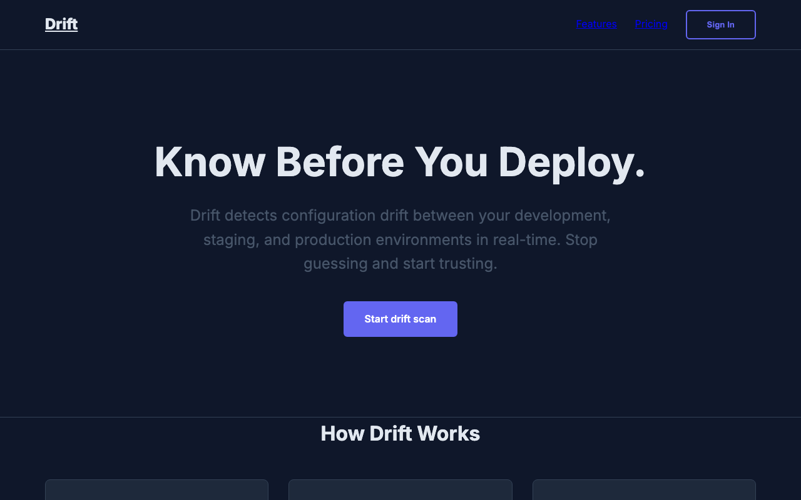
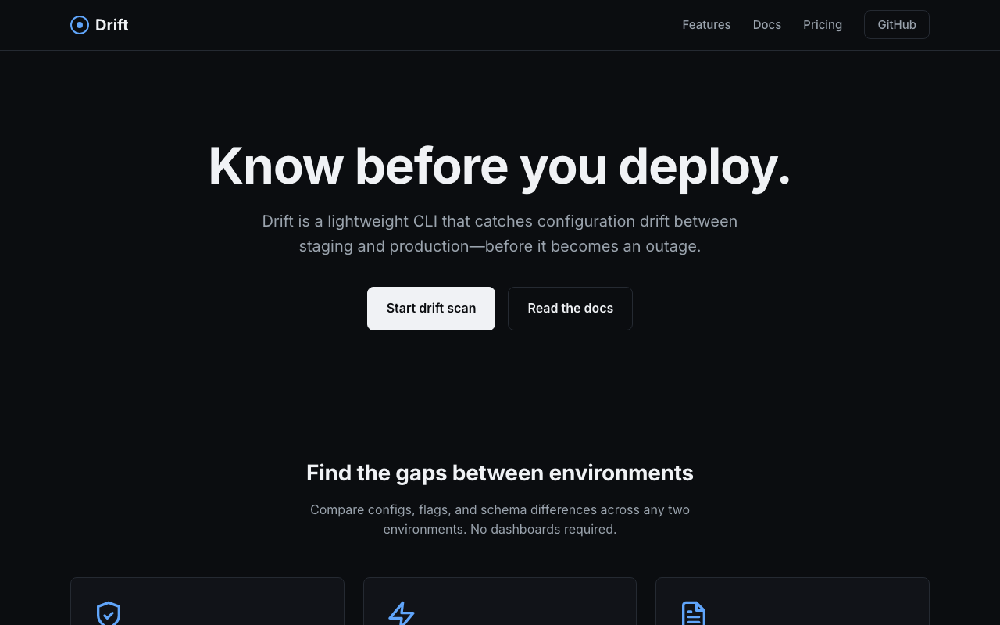
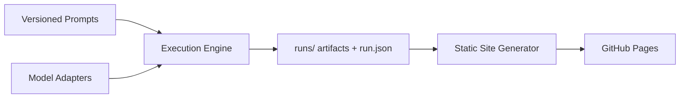

# Open Model Archive

[](LICENSE)
[](https://sopermanspace.github.io/open-model-archive/)
[](pyproject.toml)

**A transparent public archive comparing AI model outputs on identical real-world tasks.**

Not a benchmark leaderboard. Every prompt is versioned. Every artifact is public. Every execution records timing, tokens, and cost when available.

---

## Live archive

**[View the comparison site →](https://sopermanspace.github.io/open-model-archive/)**

---

## First published run

**Task:** Developer Tool Landing Page (`website-generation`)  
**Prompt:** v1.0.0 — identical for all models  
**Brief:** Generate a single-file HTML landing page for a fictional CLI called *Drift*

| Model | Provider | Duration | Tokens (in → out) | Status |
|-------|----------|----------|-------------------|--------|
| Gemma 4 | Ollama | 66.0s | 242 → 4.3k | success |
| Kimi K2.7 Code | Ollama Cloud | 76.4s | 223 → 7.1k | success |

### Side-by-side outputs

<p align="center">
  
  
</p>

<p align="center"><em>Same prompt. Same task. Inspect the full HTML, screenshots, and raw output on the comparison page.</em></p>

---

## Why this exists

Most model evaluations reduce to a single score. Developers need something else: **the actual output** — source files, screenshots, latency, token usage — for the same prompt.

Open Model Archive stores all of it in Git. The website is a static view over committed artifacts.

---

## How it works



1. **Prompts** live as versioned Markdown in `prompts/`
2. **`oma build`** executes tasks through model adapters
3. **Runs** are stored under `runs/` with structured metadata
4. **Static HTML** is generated into `docs/` for GitHub Pages

---

## Model providers

| Type | Adapter | Examples |
|------|---------|----------|
| Open-source / Ollama cloud | `ollama` | Gemma 4, Kimi K2.7 Code |
| Frontier CLIs | `agy` | Claude Sonnet, Gemini (via `agy --print`) |
| Direct APIs | planned | Providers without local CLI tooling |

Add a model by copying [`models/_template.yaml`](models/_template.yaml). No code changes required for Ollama models.

---

## Quick start

```bash
git clone https://github.com/sopermanspace/open-model-archive.git
cd open-model-archive

uv sync
npm install && npx playwright install chromium

# Pull models (Ollama)
ollama pull gemma4:latest
ollama pull kimi-k2.7-code:cloud

# Execute tasks + build site
uv run oma build

# Preview locally
python -m http.server 8080 --directory docs
```

### CLI commands

| Command | Description |
|---------|-------------|
| `oma validate` | Check tasks, prompts, and model configs |
| `oma run --all` | Execute all tasks against enabled models |
| `oma generate` | Build static site from committed runs |
| `oma build` | Validate → run → generate |

---

## Repository layout

```
prompts/          Versioned prompts (immutable by version)
tasks/            Task definitions (YAML)
models/           Model adapter configuration
runs/             Public execution archive (run.json + artifacts)
src/oma/          Python build pipeline
docs/             Generated static site (GitHub Pages)
```

---

## Documentation

- [Architecture](ARCHITECTURE.md) — module design and extension points
- [Setup](SETUP.md) — local development and provider configuration
- [Deployment](DEPLOYMENT.md) — GitHub Pages publishing
- [Contributing](CONTRIBUTING.md) — add tasks, models, and runs

---

## Contributing

Contributions welcome. Add a versioned prompt, define a task, run `oma build`, and commit the resulting `runs/` artifacts.

See [CONTRIBUTING.md](CONTRIBUTING.md).

---

## License

[MIT](LICENSE) — open source, fully reproducible, no hidden prompts or credentials in the repository.